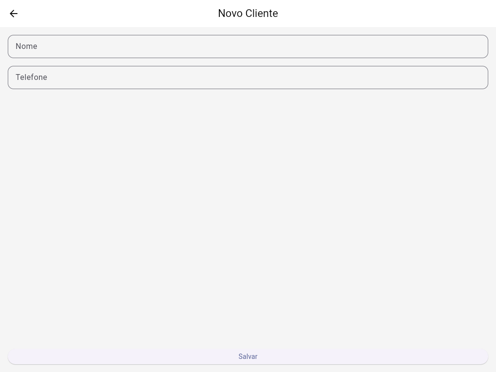
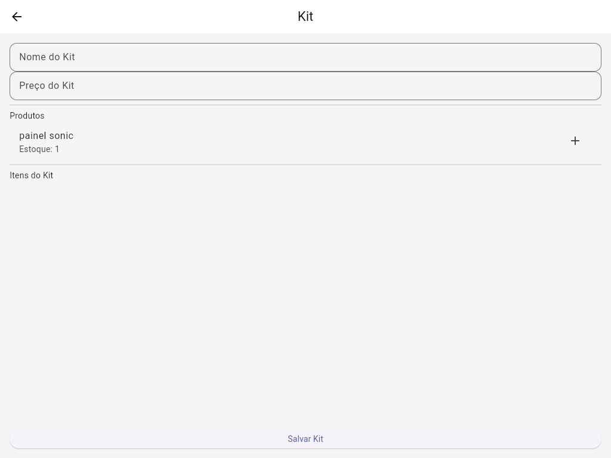
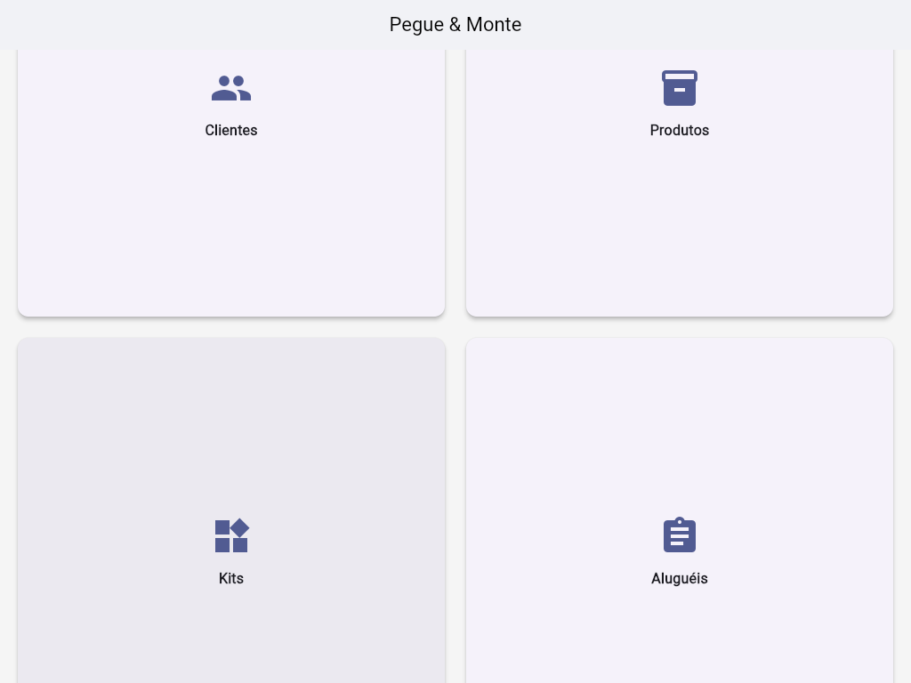
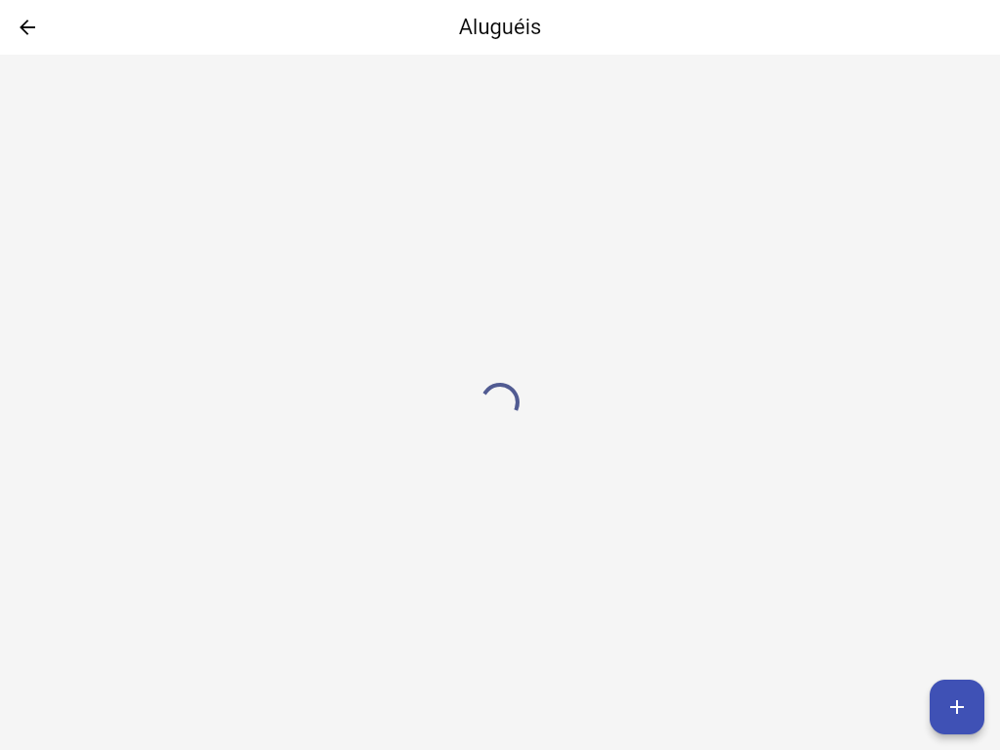
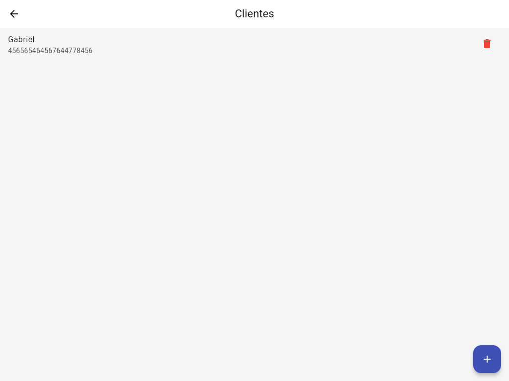
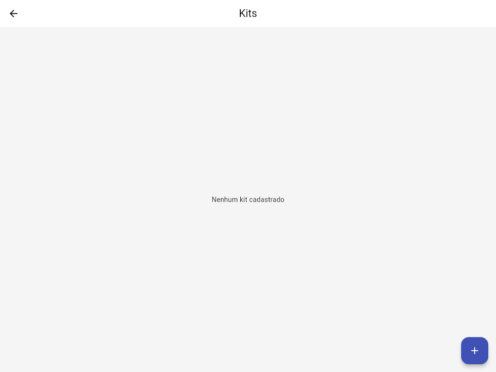

# 📦 Pegue & Monte

Aplicativo Flutter para **gestão de produtos, kits, clientes e aluguéis**, integrando controle de estoque e fluxo de locação de forma simples e organizada.

---

## 🚀 Funcionalidades

* 📋 Cadastro e listagem de **Produtos**
* 🧰 Criação e gerenciamento de **Kits**
* 👥 Cadastro de **Clientes**
* 📅 Controle de **Aluguéis**
* 📊 Dashboard central com acesso rápido às funcionalidades
* 🔥 Integração com **Firebase**
* 🎨 Tema global customizado

---

## 🧱 Arquitetura do Projeto

O projeto utiliza uma **arquitetura modular (feature-based)**, focada em escalabilidade e manutenção.

```
lib/
 ├── core/
 │    ├── services/        # Regras de negócio e integração (Firebase / API)
 │    └── theme/           # Tema global da aplicação
 │
 ├── models/               # Modelos de domínio (entidades)
 │
 ├── modules/              # Funcionalidades do app
 │    ├── alugueis/
 │    ├── clientes/
 │    ├── dashboard/
 │    ├── kits/
 │    └── produtos/
 │
 ├── firebase_options.dart # Configuração do Firebase
 └── main.dart             # Ponto de entrada da aplicação
```

### 📌 Padrão adotado

* **UI (Pages)** → Camada de apresentação
* **Controllers** → Gerenciamento de estado e regras da tela
* **Services** → Lógica de negócio e acesso a dados
* **Models** → Entidades do domínio

---

## 🛠️ Tecnologias Utilizadas

* **Flutter**
* **Dart**
* **Firebase**
* Material Design
* Arquitetura modular (feature-based)

---

## 🔥 Firebase

O projeto já está configurado com o FlutterFire:

* `firebase_options.dart` gerado automaticamente
* Integração pronta para:

  * Firestore
  * Auth (se necessário futuramente)
  * Storage (opcional)

> ⚠️ Certifique-se de configurar corretamente seu projeto Firebase antes de rodar o app.

---

## ▶️ Como Rodar o Projeto

### Pré-requisitos

* Flutter SDK instalado
* Android Studio / VS Code
* Emulador ou dispositivo físico
* Projeto Firebase configurado

### Passos

```bash
# Clonar o repositório
git clone https://github.com/gabriel2kpassos-ship-it/pegue_monte.git

# Entrar no projeto
cd pegue_monte

# Instalar dependências
flutter pub get

# Rodar o app
flutter run
```

---

## 🧪 Testes

> ⚠️ Testes ainda não implementados.

Estrutura preparada para futura inclusão de:

* Testes unitários
* Widget tests
* Testes de services

---

## 📈 Melhorias Futuras

* [ ] Implementar gerenciamento de estado avançado (Riverpod / Provider)
* [ ] Adicionar testes unitários e de widgets
* [ ] Melhorar cobertura de validações de formulários
* [ ] Otimizar performance e reutilização de widgets
* [ ] Documentar APIs e regras de negócio

---

## 📸 Screenshots
  
 
 
 
 
 
 
 

---

## 👤 Autor

**Gabriel Passos**
Desenvolvedor Flutter

GitHub: [@gabriel2kpassos-ship-it](https://github.com/gabriel2kpassos-ship-it)
